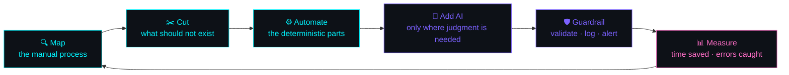

<!-- ═══════════════════════════════════════════════════════════════
        ABUMA HINSENE  //  AI & AUTOMATION ENGINEER  //  ONLINE
     ═══════════════════════════════════════════════════════════════ -->

<div align="center">
  
</div>

<div align="center">
  
</div>

<div align="center">
  <a href="https://www.linkedin.com/in/abuma-hinsene-01604129b/"></a>
  
  
  
</div>

<br/>

<!-- ══════════════════════ ABOUT ══════════════════════ -->

## `~/whoami`

```yaml
identity:
  name:      Abuma Hinsene
  role:      AI & Automation Engineer
  degree:    B.Sc. Software Engineering — HiLCoE School of
             Computer Science & Technology (Graduated)
  location:  Addis Ababa, Ethiopia  🇪🇹
  timezone:  UTC+3 (EAT)

what_i_actually_do:
  - Design and ship LLM-powered agents that do real work
  - Wire systems together so humans stop copy-pasting between them
  - Turn manual, repetitive processes into reliable pipelines
  - Build the software around the AI — APIs, dashboards, integrations

stack_focus:
  languages:   [Python, JavaScript, TypeScript, Dart]
  ai:          [LLM APIs, prompt engineering, RAG, agents, tool use]
  automation:  [n8n, Make, Zapier, webhooks, cron, schedulers, scrapers]
  backends:    [FastAPI, Flask, Node.js, REST APIs]
  data:        [MongoDB, MySQL, PostgreSQL, vector DBs]

philosophy:
  - "If a human does it three times, a machine should do it the fourth."
  - "An agent without guardrails is just a fast mistake."
  - "Automate the boring part; keep the judgment part."
  - "Write code that the next person can read."

fun_facts:
  - ☕ Debugging fuel - coffee + lo-fi
  - 🌍 Multilingual - Afaan Oromo · Amharic · English
  - 🤖 Has automated things nobody asked me to automate
  - 🎯 Goal - build AI systems that people in my community actually use
```

<br/>

<!-- ══════════════════════ WHAT I BUILD ══════════════════════ -->

## `~/what_i_build`

<table align="center">
<tr>
<td width="25%" align="center">

### 🤖 AI Agents
`LLM APIs` · `Tool use`
`RAG` · `Prompting`

Agents that call tools,
read your data, and
finish the task — not
just chat about it.

</td>
<td width="25%" align="center">

### ⚙️ Automation
`n8n` · `Make` · `Zapier`
`Webhooks` · `Cron`

Workflows that run at
3 AM so nobody has to.
Retries, logging and
alerts included.

</td>
<td width="25%" align="center">

### 🔗 Integrations
`REST` · `Scraping`
`Bots` · `APIs`

Gluing CRMs, sheets,
inboxes and chat apps
into one system that
actually talks.

</td>
<td width="25%" align="center">

### 🌐 App Layer
`FastAPI` · `React`
`Flutter` · `Databases`

The dashboards, APIs
and front-ends that
make automation
usable by humans.

</td>
</tr>
</table>

<br/>

<!-- ══════════════════════ HOW I WORK ══════════════════════ -->

## `~/how_i_work`



> **The rule I work by:** AI is the last step, not the first one.
> Most "AI problems" are process problems wearing a costume.

<br/>

<!-- ══════════════════════ STACK ══════════════════════ -->

## `~/tech_stack`

<div align="center">

**AI & Automation**


**Languages**


**Frameworks & Runtimes**


**Data & Infra**


**Tools**


</div>

<br/>

<!-- ══════════════════════ STATS ══════════════════════ -->

## `~/telemetry`

<div align="center">
  
  
</div>

<div align="center">
  
</div>

<div align="center">
  
</div>

<div align="center">
  
</div>

<br/>

<!-- ══════════════════════ OBJECTIVES ══════════════════════ -->

## `~/roadmap`

**Post-Grad Objectives — 2026**

- [x] Graduated B.Sc. Software Engineering, HiLCoE
- [x] Ship AI-powered automations that run in production
- [ ] Open-source an agent / automation toolkit
- [ ] Go deep on agent orchestration & evaluation
- [ ] Build automation infrastructure for Ethiopian businesses
- [ ] Land a role where the AI I ship actually matters

<br/>

<!-- ══════════════════════ CONTACT ══════════════════════ -->

## `~/connect`

<div align="center">

<a href="mailto:acesono53@gmail.com">
  
</a>
<a href="https://www.linkedin.com/in/abuma-hinsene-01604129b/">
  
</a>
<a href="https://github.com/acesono">
  
</a>

<br/><br/>

**Got a process that eats your week? I will automate it.**

*Open to full-time roles, freelance automation work, and AI projects.*

</div>

<br/>

<div align="center">
  
</div>

<div align="center">
  
</div>
