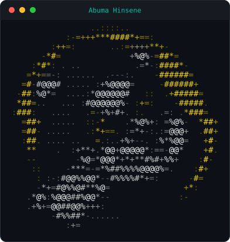

<div align="center">


<p>
  <a href="https://github.com/acesono?tab=followers"></a>
  
</p>



</div>

```python
class AbumaHinsene:
    role      = "AI Engineer"
    focus     = ["LLM agents", "Telegram bots", "workflow automation"]
    stack     = ["Python", "FastAPI", "Node.js", "TypeScript", "Docker"]
    education = "B.Sc. Software Engineering, HiLCoE — graduated"
    motto     = "if a human does it twice, a bot should do it forever"

    def ship(self, idea: str) -> "Production":
        return self.design(idea).build().automate().deploy()
```

<div align="center">

`▰▰▰▰▰▰▰▰▰▰▰▰▰▰▰▰▰▰▰▰▰▰▰▰▰▰▰▰▰▰▰▰▰▰▰▰`

</div>

## `~/` what I build

| | |
|---|---|
| 🤖 **AI agents** | Tool-using, memory-backed agents — RAG pipelines, function calling, multi-step reasoning loops |
| ✈️ **Telegram bots** | Production bots on `aiogram` / `python-telegram-bot`: payments, admin panels, webhooks, async at scale |
| ⚙️ **Automation** | Scrapers, schedulers, CI pipelines and API glue that quietly remove manual work |
| 🧠 **LLM integrations** | Claude / OpenAI / open-weight models wired into real products with guardrails and observability |
| 🚀 **Backends** | FastAPI & Node services, PostgreSQL/Mongo/Redis, containerized and deployed |

## `~/` stack

<div align="center">

**AI · ML**


**Backend · APIs**


**Data · Storage**


**Automation · Infra**


**Tooling**


<p>
  
  
  
  
  
  
</p>

</div>

## `~/` stats

<div align="center">


<br/><br/>


</div>

## `~/` reach me

<div align="center">

<a href="mailto:acesono53@gmail.com"></a>
<a href="https://www.linkedin.com/in/abuma-hinsene-01604129b/"></a>
<a href="https://github.com/acesono"></a>

<br/><br/>

<sub><code>$ open to AI agent, Telegram bot and automation work — say hi.</code></sub>


</div>
