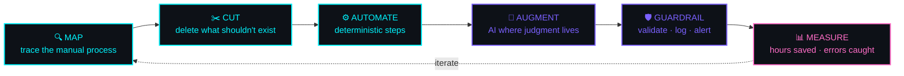

<!-- ══════════════════════════════════════════════════════════════════
     ABUMA HINSENE · AI & AUTOMATION ENGINEER · github.com/acesono
     ══════════════════════════════════════════════════════════════════ -->

<div align="center">
  
</div>

<div align="center">
  
</div>

<div align="center">
  
  
  
  
</div>

<br/>

<!-- ═════════════════════════ 01 · IDENTITY ═════════════════════════ -->

## <samp>01 · `~/whoami`</samp>

```console
$ cat /etc/profile.d/abuma.conf

┌─ IDENTITY ─────────────────────────────────────────────────────────┐
│  name      Abuma Hinsene                                           │
│  role      AI & Automation Engineer                                │
│  degree    B.Sc. Software Engineering · HiLCoE  [GRADUATED]        │
│  base      Addis Ababa, Ethiopia · UTC+3                           │
│  langs     Afaan Oromo · Amharic · English                         │
└────────────────────────────────────────────────────────────────────┘

$ systemctl status abuma.service

● abuma.service — turning manual work into running software
     Loaded: loaded (/usr/lib/systemd/abuma.service; enabled)
     Active: active (running) ● since graduation
   Main PID: 1337 (shipping)
     Memory: caffeine-backed
     CGroup: ├─ agent-orchestrator.py
             ├─ webhook-listener.js
             ├─ nightly-etl.cron
             └─ scraper-pool.worker
```

<br/>

<!-- ═════════════════════════ 02 · MANDATE ══════════════════════════ -->

## <samp>02 · `~/mandate`</samp>

```python
class AbumaHinsene(AIEngineer):
    """I build systems that do the work, not systems that discuss it."""

    def __init__(self):
        self.focus = ["LLM agents", "workflow automation", "integrations"]
        self.stack = ["Python", "TypeScript", "JavaScript", "Dart"]
        self.rule  = "AI is the last step, never the first."

    def solve(self, painful_manual_process):
        steps = self.map_process(painful_manual_process)
        steps = [s for s in steps if s.actually_necessary]      # cut waste
        auto  = [self.automate(s) for s in steps if s.deterministic]
        smart = [self.add_agent(s) for s in steps if s.needs_judgment]
        return Pipeline(auto + smart).guardrail().log().monitor()

    def __repr__(self):
        return "<Abuma · if it repeats three times, it gets automated>"
```

<br/>

<!-- ═════════════════════════ 03 · CAPABILITIES ═════════════════════ -->

## <samp>03 · `~/capabilities`</samp>

<table>
<tr>
<td width="50%" valign="top">

#### `[01]` AI AGENTS
```
├── LLM API integration
├── tool-use & function calling
├── RAG over private data
├── prompt design + evals
└── multi-step orchestration
```
Agents that call tools, read real
data and **finish the task**.

</td>
<td width="50%" valign="top">

#### `[02]` AUTOMATION
```
├── workflow builders (n8n/Make)
├── webhooks & event triggers
├── cron jobs & schedulers
├── scraping & data capture
└── retries · logging · alerts
```
Pipelines that run at 3 AM so
**nobody has to**.

</td>
</tr>
<tr>
<td width="50%" valign="top">

#### `[03]` INTEGRATIONS
```
├── REST / JSON APIs
├── CRM · sheets · inboxes
├── chat bots (TG / Slack)
├── auth & rate limiting
└── data sync & migration
```
Making disconnected tools
**speak the same language**.

</td>
<td width="50%" valign="top">

#### `[04]` APP LAYER
```
├── FastAPI · Flask backends
├── React dashboards
├── Flutter mobile clients
├── SQL / NoSQL / vector DBs
└── Docker deployment
```
The surface that makes automation
**usable by humans**.

</td>
</tr>
</table>

<br/>

<!-- ═════════════════════════ 04 · PIPELINE ═════════════════════════ -->

## <samp>04 · `~/how_i_work`</samp>



> [!NOTE]
> **Most "AI problems" are process problems wearing a costume.**
> I map and cut before I automate, and automate before I reach for a model.
> That order is why the systems still run six months later.

<br/>

<!-- ═════════════════════════ 05 · STACK ════════════════════════════ -->

## <samp>05 · `~/stack`</samp>

<div align="center">

<samp>**AI · AUTOMATION**</samp>


<samp>**LANGUAGES**</samp>


<samp>**FRAMEWORKS · RUNTIMES**</samp>


<samp>**DATA · INFRA**</samp>


<samp>**TOOLING**</samp>


</div>

<br/>

<!-- ═════════════════════════ 06 · ROADMAP ══════════════════════════ -->

## <samp>06 · `~/roadmap`</samp>

<details open>
<summary><samp><b>▸ EXECUTION LOG — 2026</b></samp></summary>

<br/>

```diff
+ [DONE]  B.Sc. Software Engineering · HiLCoE
+ [DONE]  AI automations running in production
! [WIP]   agent orchestration & evaluation — going deep
! [WIP]   open-source agent / automation toolkit
- [TODO]  automation infrastructure for Ethiopian businesses
- [TODO]  a role where the AI I ship actually matters
```

</details>

<br/>

<!-- ═════════════════════════ 07 · CONTACT ══════════════════════════ -->

## <samp>07 · `~/connect`</samp>

<div align="center">

<a href="mailto:acesono53@gmail.com">
  
</a>
<a href="https://www.linkedin.com/in/abuma-hinsene-01604129b/">
  
</a>
<a href="https://github.com/acesono">
  
</a>

<br/><br/>

```console
$ ./hire-abuma.sh --help

USAGE: reach out if you have —
  → a process that eats hours every week
  → an AI feature that needs to actually ship
  → tools that refuse to talk to each other

STATUS: open to full-time · freelance automation · AI projects
```

</div>

<div align="center">
  
</div>
