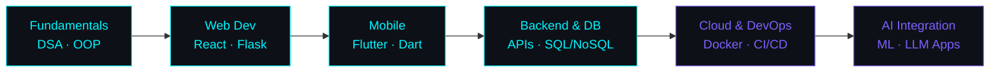

<!-- ═══════════════════════════════════════════════════════════════
        ABUMA HINSENE  //  SOFTWARE ENGINEER  //  SYSTEM ONLINE
     ═══════════════════════════════════════════════════════════════ -->

<div align="center">
  
</div>

<div align="center">
  
</div>

<div align="center">
  <a href="https://www.linkedin.com/in/abuma-hinsene-01604129b/"></a>
  
  
</div>

<br/>

<!-- ══════════════════════ ABOUT ══════════════════════ -->


## `~/whoami`

```yaml
identity:
  name:      Abuma Hinsene
  role:      Software Engineering Student & Developer
  school:    HiLCoE School of Computer Science & Technology
  location:  Addis Ababa, Ethiopia  🇪🇹
  timezone:  UTC+3 (EAT)

current_focus:
  languages:   [Python, JavaScript, Dart, Java, C#]
  building:    Full-stack web apps & cross-platform mobile
  learning:    System design, clean architecture, cloud deployment
  exploring:   AI/ML integrations, real-time systems

philosophy:
  - "Write code that the next person can read."
  - "Ship it, measure it, improve it."
  - "Every bug is a lesson wearing a disguise."

fun_facts:
  - ☕ Debugging fuel: coffee + lo-fi
  - 🌍 Multilingual: Afaan Oromo · Amharic · English
  - 🧩 Loves turning messy problems into elegant systems
  - 🎯 Goal: build software that people in my community actually use
```

<br/>

<!-- ══════════════════════ WHAT I DO ══════════════════════ -->

## `~/what_i_do`

<table align="center">
<tr>
<td width="33%" align="center">

### 🌐 Web
`React` · `Flask` · `HTML/CSS`
`Bootstrap` · `REST APIs`

Responsive front-ends and
clean, documented back-ends.

</td>
<td width="33%" align="center">

### 📱 Mobile
`Dart` · `Flutter`

Cross-platform apps with
native-feel UX from a
single codebase.

</td>
<td width="33%" align="center">

### 🗄️ Data
`MongoDB` · `MySQL`

Schema design, queries
that don't melt the server,
and sane migrations.

</td>
</tr>
</table>

<br/>

<!-- ══════════════════════ STACK ══════════════════════ -->

## `~/tech_stack`

<div align="center">

**Languages**


**Frameworks & Libraries**


**Databases & Cloud**


**Tools & Workflow**


</div>

<br/>

<!-- ══════════════════════ STATS ══════════════════════ -->

## `~/telemetry`

<div align="center">
  
  
</div>

<div align="center">
  
</div>

<div align="center">
  
</div>

<div align="center">
  
</div>

<br/>

<!-- ══════════════════════ ROADMAP ══════════════════════ -->

## `~/roadmap`



**2026 Objectives**

- [x] Ship a full-stack project end to end
- [x] Get comfortable across three language ecosystems
- [ ] Contribute to open source consistently
- [ ] Deploy a production app with real users
- [ ] Go deep on system design & scalability

<br/>

<!-- ══════════════════════ CONTACT ══════════════════════ -->

## `~/connect`

<div align="center">

<a href="mailto:acesono53@gmail.com">
  
</a>
<a href="https://www.linkedin.com/in/abuma-hinsene-01604129b/">
  
</a>
<a href="https://github.com/acesono">
  
</a>
<a href="https://t.me/">
  
</a>

<br/><br/>

*Open to internships, collaborations, and interesting problems.*
*If you're building something ambitious — let's talk.*

</div>

<br/>

<div align="center">
  
</div>

<div align="center">
  
</div>
